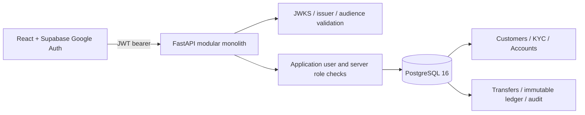
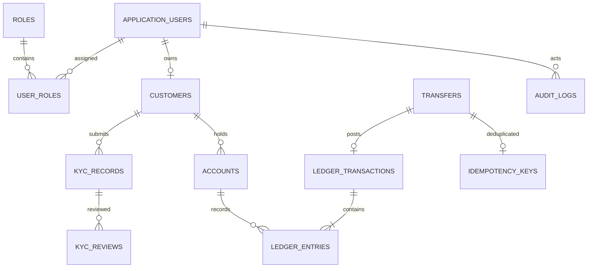

# Banking Core Operations

A modular FastAPI and React operations workspace using PostgreSQL. The API serves Swagger at `http://localhost:8000/docs`; the Vite UI runs at `http://localhost:5173`.

## Configure and run

1. Copy `.env.example` to `.env`. Keep the already configured PostgreSQL database values and port `5433` intact. Copy `SUPABASE_URL` and the browser-safe `VITE_SUPABASE_URL` and `VITE_SUPABASE_PUBLISHABLE_KEY` from the existing Supabase project. Set a local `POSTGRES_PASSWORD` and matching `DATABASE_URL`. Set `SUPABASE_JWT_AUDIENCE` to the token audience (normally `authenticated`). No service role key is used.
2. Start database and backend: `docker compose up --build -d`.
3. Start UI: `cd frontend && npm install && npm run dev`.
4. Sign in with Google. Newly authenticated users have no roles by design. Assign an initial administrator directly using a trusted SQL session, then manage the remaining users through the administrator API. For example, after login the UUID is visible at `/api/me`; use SQL to insert `administrator` into `roles` and the matching row into `user_roles`. Role claims from the browser are never trusted.

For local API development without Docker, install `backend/requirements.txt` in a Python 3.11+ environment and run `cd backend && alembic upgrade head && uvicorn app.main:app --reload`. Configure the root `.env` first. Run the UI in a second terminal.

## Configuration names

Required database values: `POSTGRES_DB`, `POSTGRES_USER`, `POSTGRES_PASSWORD`, `DATABASE_URL`. Supabase: `SUPABASE_URL` and `SUPABASE_JWT_AUDIENCE` (server), `VITE_SUPABASE_URL` and `VITE_SUPABASE_PUBLISHABLE_KEY` (browser). Optional: `FRONTEND_ORIGIN`, `VITE_API_URL`. Use the public publishable key; no privileged Supabase key is needed. `.env` is ignored by Git.

## Architecture



### Entity relationships



### Transfer sequence

```mermaid
sequenceDiagram
  participant C as Client
  participant A as API
  participant D as PostgreSQL
  C->>A: POST transfer + Idempotency-Key
  A->>D: Begin transaction; check idempotency
  A->>D: Lock both account rows ordered by UUID
  A->>D: Validate status, currency, owner, available balance
  A->>D: Insert transfer, balanced ledger entries, audit, key; update projections
  A->>D: Commit
  A-->>C: Posted result
```

## Role and permission matrix

| Role | Scope |
| --- | --- |
| Customer | Own profile, accounts, statements, transfers |
| Teller | Customer lookup, account opening, transfers |
| Operations | Teller scope, operational views and reconciliation |
| Compliance officer | KYC queue and review |
| Auditor | Read-only audit and reconciliation reporting |
| Administrator | User role management and operational access |

## API and security notes

All endpoints are discoverable in Swagger. Main routes: `/api/me`, `/api/dashboard`, `/api/customers`, `/api/kyc`, `/api/accounts`, `/api/transfers`, `/api/accounts/{id}/statement`, `/api/reports/reconciliation`, `/api/audit`, and `/api/admin/roles`. Health endpoints are `/health` and `/health/db`.

Access tokens are verified against Supabase JWKS with ES256/RS256 allowlisting, issuer and audience checks. A verified `sub` is mapped to a local user; roles live in the database. The transfer API locks accounts in sorted UUID order, checks constraints after locking, stores amount as NUMERIC/Decimal, commits both ledger sides and projections together, and binds idempotency keys to a request hash. Posted entries are application-immutable; production deployments should additionally enforce immutability with database permissions/triggers and operational controls. Customer funding is deliberately not exposed: any funding flow must use a separately controlled system clearing account and balanced posting.

KYC uses synthetic references only. Never submit real Aadhaar/PAN or customer financial data. Demo onboarding does not automate identity verification, sanctions screening, payment rails, or regulatory reporting. Initial admin bootstrap is a trusted operator action. TLS, key rotation, rate limits, fraud controls, retention policy, backup/restore drills, and independent security review are deployment requirements.

## Tests

Focused tests live under `backend/tests`. Run with `cd backend && pytest -q` after installing backend requirements.
