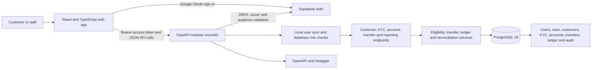
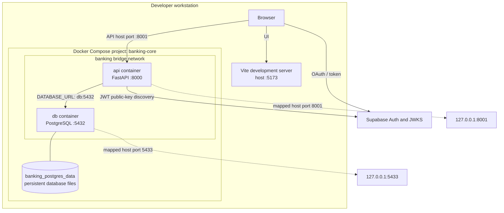
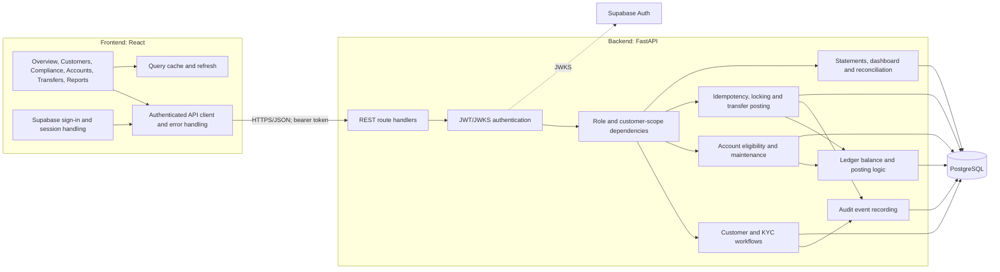
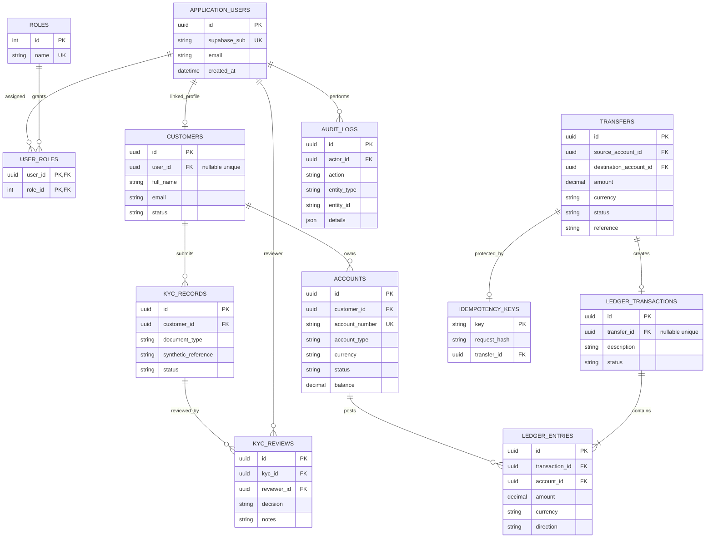
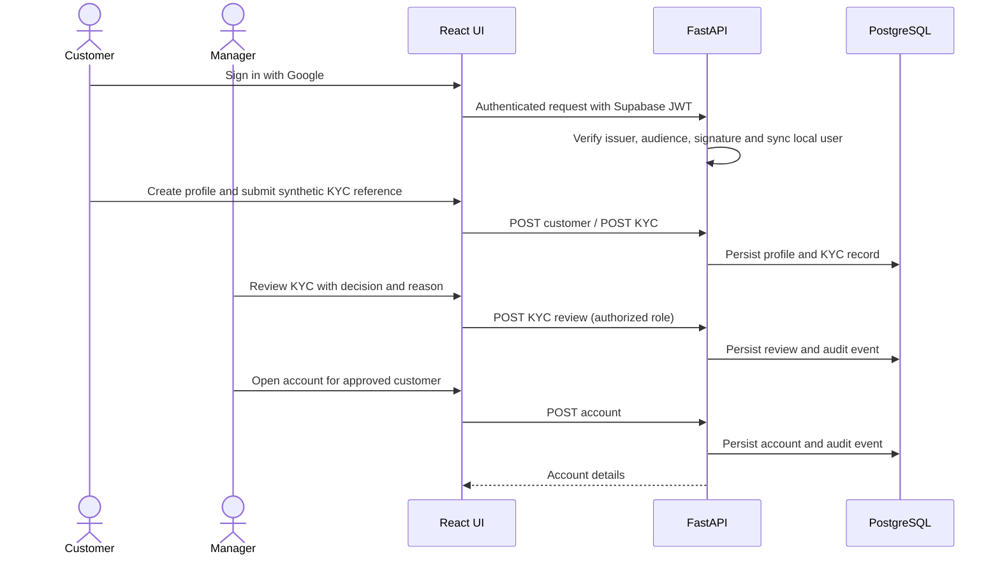
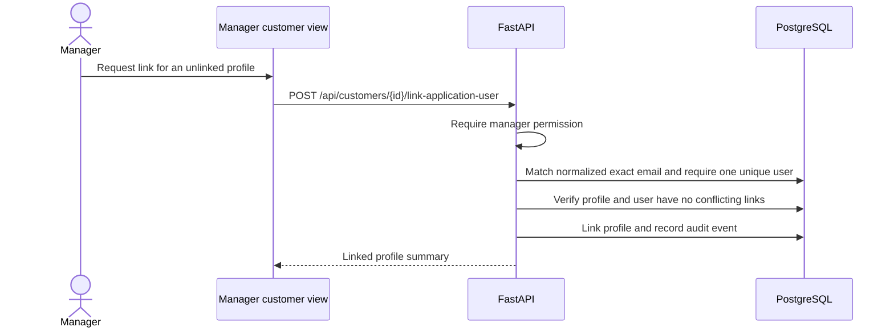

# BankCRM — Banking Core Operations Demo

BankCRM is a browser-based internal banking operations demo. It combines a React operations workspace, a FastAPI modular monolith, PostgreSQL, and Supabase Google sign-in. The demo covers customer onboarding and synthetic KYC review, account servicing, internal transfers, double-entry ledger postings, reporting, reconciliation, and audit history.

> **Scope:** This is a learning/demo application. KYC references and seeded customer data are synthetic. It is not connected to payment rails and is not a production banking system. Do not enter real identity documents, credentials, or customer financial data.

## What the application does

- Authenticates users with Supabase Auth and Google OAuth. On first verified login the API creates a local application-user record with the customer role.
- Maintains local roles and permissions independently of browser state. A trusted operator explicitly provisions the configured manager as an administrator.
- Lets a customer create or view their own customer profile, submit a fictional KYC reference, see review status, and access only their own accounts and history.
- Lets authorized staff review KYC submissions with a decision and reason, open customer accounts, perform permitted account maintenance, and view operational dashboards.
- Supports synthetic demo seeding for onboarding cases, accounts, balanced funding postings, transfers, and audit events. Seeding is additive and does not create/promote app users.
- Displays the signed-in customer's transfer source accounts only when ownership, active status, positive ledger-derived funds, active customer profile, and balance-projection consistency checks pass. A single eligible source is selected automatically; multiple sources can be selected; an ineligible/empty state explains the next step.
- Offers eligible same-currency destinations according to server-side account/customer status rules. Customer transfer authorization is enforced by the API, including source ownership.
- Posts transfers atomically with `Decimal`/`NUMERIC` amounts, ordered row locks, sufficient-funds checks, balanced ledger entries, account balance projections, audit events, and an idempotency key. A retry with the same key and payload does not post a second debit.
- Shows statements, transfer history, dashboard summaries, audit events, and a reconciliation report comparing ledger-derived balances with account projections.
- Provides health endpoints and interactive OpenAPI/Swagger documentation.

## Technology and repository layout

| Area | Implementation |
| --- | --- |
| Web client | React 19, TypeScript, Vite, React Router, TanStack Query, Lucide icons |
| Authentication | Supabase JS client, Supabase Auth Google OAuth, server-side JWT/JWKS validation |
| API | FastAPI, Pydantic, SQLAlchemy 2, Psycopg 3 |
| Database | PostgreSQL 16 (`pgvector/pgvector` image; current application data is relational) |
| Schema changes | Alembic migrations run by the API container before Uvicorn starts |
| Local deployment | Docker Compose for API + database; Vite development server for the UI |

Main areas: `frontend/src/` (UI, auth and API client), `backend/app/` (routes, auth, services, models and CLI), `backend/alembic/` (migrations), `backend/tests/` (API/service tests), `compose.yaml` (local services), `.env.example` (configuration template).

## Local setup and launch

### Requirements

- Docker Desktop / Docker Engine with Compose
- Node.js and npm compatible with the frontend toolchain
- A Supabase project with Google sign-in enabled and the local redirect URL allowed

### Configure

1. Copy `.env.example` to `.env`.
2. Fill in `SUPABASE_URL`, `VITE_SUPABASE_URL`, and the browser-safe `VITE_SUPABASE_PUBLISHABLE_KEY` from the Supabase project. Set `SUPABASE_JWT_AUDIENCE` to the token audience (normally `authenticated`).
3. Set a local `POSTGRES_PASSWORD` and matching `DATABASE_URL` if changing the example values. Keep the established host ports: API `8001`, PostgreSQL `5433`.
4. Keep `.env` private; it is ignored by Git. Never put a Supabase service-role key in the browser environment.

Vite reads the root `.env` when it starts. Restart Vite after changing `VITE_*` values.

### Start

```sh
docker compose up --build -d
docker compose ps
docker compose logs -f api
```

The API waits for PostgreSQL, verifies a connection, applies Alembic migrations, then starts Uvicorn. A migration failure exits clearly so it is visible in the API logs.

In another terminal:

```sh
cd frontend
npm install
npm run dev
```

Open `http://localhost:5173`; Swagger is at `http://localhost:8001/docs`. Health checks: `http://localhost:8001/health` and `http://localhost:8001/health/db`.

### Manager setup and synthetic demo data

1. Sign in once with the configured manager Google account so its verified identity exists in the local application-user table.
2. Provision manager rights with the trusted operator command:

   ```sh
   docker compose exec api python -m app.cli provision-manager
   ```

   The command only grants the administrator role to the configured manager email when that user already exists, and records an audit event. It is safe to rerun.
3. Add synthetic walkthrough data:

   ```sh
   docker compose exec api python -m app.cli seed-demo
   ```

For a customer transfer walkthrough, sign in as a separate customer, create the profile, submit a synthetic reference, have the manager approve KYC and open/fund the account through authorized workflows, then choose an eligible destination. Manager-created profiles must be linked to the intended signed-in application user using the manager's exact-identity linking workflow. Do not relink based only on a display name.

### Restart and stop

```sh
docker compose up --build -d
docker compose ps
curl -fsS http://localhost:8001/health/db
```

Stop containers while preserving PostgreSQL data:

```sh
docker compose down
```

The named `banking_postgres_data` volume persists database files. Do not run `docker compose down -v` unless intentionally destroying local data.

### Local API development outside Docker

Use a Python environment with `backend/requirements.txt` installed and the root `.env` available. For host-side API access the PostgreSQL hostname in `DATABASE_URL` must be `localhost` with port `5433`.

```sh
cd backend
alembic upgrade head
uvicorn app.main:app --reload --port 8001
```

## High-level architecture diagram



## Deployment diagram

The current supported deployment is local Compose for API/database plus a local Vite server. The Supabase project is an external managed identity service.



Compose health-gates the API on PostgreSQL health. The API performs a connection retry and migration before serving requests. Containers use the shared `banking` bridge network and Compose DNS service name `db`; host tools use ports `5433` and `8001`. The host port bindings are loopback-only by default.

## Component diagram



## Database ER diagram

UUIDs are used for application/customer/account/transaction identifiers. Monetary values use PostgreSQL `NUMERIC(20,2)` and Python `Decimal`. The account `balance` is a projection; posted ledger entries are the source used by transfer eligibility and reconciliation checks.



## Core workflows and sequence diagrams

### Customer onboarding, approval and account opening



### Internal transfer posting

```mermaid
sequenceDiagram
  actor User as Customer or authorized manager
  participant UI as React transfer form
  participant API as FastAPI transfer endpoint
  participant DB as PostgreSQL
  User->>UI: Select eligible source/destination and amount
  UI->>API: POST /api/transfers + Bearer + Idempotency-Key
  API->>DB: Begin transaction; acquire key-scoped idempotency lock
  API->>DB: Return existing result if key and payload match
  API->>DB: Lock source and destination rows in stable UUID order
  API->>API: Check caller role/ownership, status, currency and funds
  API->>DB: Insert transfer and posted ledger transaction
  API->>DB: Insert source debit and destination credit entries
  API->>DB: Update account projections, idempotency record and audit event
  API->>DB: Commit atomically
  API-->>UI: Transfer result
  UI->>API: Refresh accounts, history and statements
```

### Safe profile linking



## API documentation

Interactive schema: `http://localhost:8001/docs` (Swagger UI) and `http://localhost:8001/openapi.json`. Unless marked public, `/api/*` operations require `Authorization: Bearer <Supabase access token>`. Backend role and ownership checks remain authoritative.

| Endpoint | Purpose / access summary |
| --- | --- |
| `GET /health`, `GET /health/db` | Liveness and database connectivity checks |
| `GET /api/me` | Signed-in local user, roles, linked profile and safe transfer-link diagnostics |
| `GET /api/dashboard` | Operational dashboard summary; role-scoped data |
| `POST /api/customers`, `GET /api/customers` | Customer profile creation and scoped listing/details |
| `POST /api/customers/{customer_id}/link-application-user` | Manager-only safe exact-identity profile linking; audited |
| `POST /api/kyc/{customer_id}`, `GET /api/kyc/mine` | Customer synthetic KYC submission and own KYC status |
| `GET /api/kyc` | Authorized review queue |
| `POST /api/kyc/{kyc_id}/review` | Authorized KYC decision and reason |
| `POST /api/accounts`, `GET /api/accounts` | Authorized account opening; customer account listing is owner-scoped |
| `POST /api/accounts/{account_id}/fund` | Administrator demo funding against system-clearing ledger; requires `Idempotency-Key` |
| `PATCH /api/accounts/{account_id}` | Authorized account status maintenance |
| `GET /api/transfer-destinations` | Eligible same-currency destination candidates for the signed-in scope |
| `POST /api/transfers`, `GET /api/transfers` | Post/list transfers; POST requires `Idempotency-Key` and valid authorization |
| `GET /api/accounts/{account_id}/statement` | Statement/history for an authorized account |
| `GET /api/reports/reconciliation` | Ledger-to-projection reconciliation |
| `GET /api/audit` | Authorized audit history |
| `GET /api/admin/customers/{customer_id}/transfer-diagnostics` | Manager-only eligibility diagnosis for a customer profile |
| `GET /api/admin/users/{application_user_id}/transfer-diagnostics` | Manager-only diagnosis by local application user |
| `GET /api/admin/roles`, `PUT /api/admin/roles/{user_id}`, `GET /api/admin/permissions` | Administrative role/permission operations |

Transfer request shape and schema validation are defined in the backend Pydantic schemas. A typical logical transfer requires source account ID, destination account ID, positive amount and optional reference; the idempotency key is an HTTP header, not a JSON field. Reuse a key only for retries of the same logical payload. A changed payload needs a new key. Validation responses are surfaced by the UI without exposing server traces.

## Security, audit and data integrity

- Supabase access tokens are checked server-side with JWKS signature verification, issuer/audience validation and an allowed signing-algorithm set. The API maps the verified subject to a local application user.
- UI visibility is not authorization. The backend applies role permissions and customer ownership checks to account reads, statements, destinations and transfers.
- Customer source accounts must be owned by that customer's linked profile. Active account/customer status, currency match, sufficient ledger-derived funds and projection consistency are checked server-side. Destination status and customer eligibility are also checked server-side.
- Money is represented with `Decimal` and PostgreSQL `NUMERIC(20,2)`. Transfer posting locks both account rows in consistent UUID order, preventing concurrent overspending, and commits the transfer, two balanced entries, projections, idempotency record and audit event in one transaction.
- Idempotency keys are bound to a request hash. A matching replay returns the prior transfer; reuse with a different request is rejected.
- Business actions and manager profile linking are audit logged. Ledger entries are treated as append-only in application logic; production should enforce append-only access at the database boundary as well.
- No client-provided balance is accepted as authoritative, and account balances are not directly altered by transfer/funding UI requests; they are changed through posted ledger workflows.
- The manager's initial role assignment is an explicit trusted CLI operation, not automatic based on a browser claim.

## Non-functional needs and current status

| Need | Current support | Production work / evaluation evidence |
| --- | --- | --- |
| Scalability | Stateless API process, relational indexes, Dockerized services, scoped queries | Add API replicas behind a TLS-terminating load balancer; size PostgreSQL, pool limits, connection proxies and backups from load tests. Add pagination for large histories and scale read workloads deliberately. |
| Security | Supabase identity, verified JWTs, local role checks, ownership enforcement, exact-identity profile linking, parameterized ORM access, local loopback port bindings | TLS, secret manager and rotation, MFA/strong admin policy, rate limits, CSRF/CORS review, dependency/container scanning, threat model, least-privilege DB roles, penetration test and retention policy. |
| Observability | Container logs, `/health` and `/health/db`, audit events, reconciliation report, actionable migration errors | Structured request logs with correlation IDs; redact identifiers/secrets; metrics for latency/errors/pool/DB and transfer outcomes; traces; dashboards and actionable alerts. Do not log tokens or identity-document contents. |
| Resilience | Compose DB health gate, API DB connection retries, migration-before-start, finite restart policy, PostgreSQL named volume, atomic transactions and idempotency | Automated encrypted backups and restore drills, multi-zone DB, recovery objectives, migration rollback/forward-fix plan, graceful shutdown, timeouts, circuit/backoff policy and disaster-recovery exercise. |
| Maintainability | TypeScript UI, modular FastAPI application, Pydantic request schemas, SQLAlchemy models, Alembic migrations, API docs and tests | CI lint/type/test/build gates, architecture decision records, migration review, versioned API lifecycle and code ownership. |
| Auditability | Actor/action/entity audit records, KYC review reasons, idempotent transfer records, ledger entries, reconciliation | Restrict audit update/delete permissions, retention/export policy, tamper-evident external archive, privileged-access monitoring, documented operational procedures. |
| Performance | Query scoping/indexes, DB constraints, React Query caching, row-level locking limited to two accounts | Establish p95/p99 and throughput SLOs; profile realistic data; add pagination, targeted indexes/caching and pool tuning only with measurements. Benchmark contention and reporting queries. |

These are not claims that the demo already meets production SLOs or regulatory requirements. There is no external payment rail, automated identity verification, sanctions screening, production fraud monitoring, or high-availability deployment included.

## Trade-offs and design decisions

- **Modular monolith over microservices:** fewer moving parts and easier local review for a small demo; independent service deployment/scaling is deferred until boundaries and load needs are proven.
- **PostgreSQL transaction and row locks:** straightforward atomic double-entry posting and overspend protection; highly contended accounts can serialize transfers and need measured tuning.
- **Account balance as a projection:** convenient UI/reporting reads, reconciled against ledger entries; it is never trusted alone for transfer eligibility.
- **Supabase for identity, local database for authorization:** avoids implementing password storage while keeping application roles and ownership checks under API control; operations must keep issuer/audience/key configuration correct.
- **Synthetic funding and KYC:** enables a safe demo without claiming actual customer verification or settlement; real integrations require separate compliance, security and reconciliation design.
- **Compose and Vite local deployment:** simple reproducible developer setup; a hosted deployment requires production-grade secrets, TLS, managed persistence, monitoring, backup/restore, and operational ownership.

## Tests and verification

Backend tests are under `backend/tests`; the frontend has a production TypeScript/Vite build and focused Node tests for transfer account selection.

```sh
docker compose exec api python -m pytest -q
cd frontend
npm install
npm run build
node --test src/transferAccounts.test.js
```

Run applicable tests against an isolated test database when they require PostgreSQL. Do not point destructive test setup at the persistent demo database. Basic service verification:

```sh
docker compose ps
curl -fsS http://localhost:8001/health
curl -fsS http://localhost:8001/health/db
```

## Submission and evaluation checklist

Expected submission artifacts:

- [x] Git repository containing source, migrations, Compose configuration, tests, and this README.
- [x] README with setup, features, API map, security notes, architecture, diagrams, NFRs, and trade-offs.
- [x] High-level architecture, deployment, component, and database ER diagrams (Mermaid source above).
- [x] Flowcharts / sequence diagrams for onboarding, transfer posting, and safe profile linking.
- [ ] Demo video, 5–10 minutes (record locally; no video file is produced by this repository).
- [ ] Deployment URL, optional (the checked-in setup is local; no hosted URL is claimed).
- [ ] Architecture document, if required separately by the evaluator (the architecture sections here can be extracted).
- [x] Trade-off analysis (above); extend with measured performance and deployment decisions for a hosted submission.

Suggested 7-minute demo: (1) show architecture and health/docs, (2) sign in as customer and create a synthetic profile/KYC request, (3) sign in as manager and review KYC/open an account, (4) show account funding and transfer source eligibility, (5) post a transfer and demonstrate history/balances, (6) replay idempotency or explain how the UI retains the key across uncertain retries, (7) show reconciliation, audit event, tests and production gaps.

## Troubleshooting

- **API won't start:** `docker compose logs --tail=200 api`; look for PostgreSQL connectivity or Alembic migration diagnostics.
- **Database connection:** `docker compose ps` should show `db` healthy and `api` running. Container-to-container DSN uses `db:5432`; host tools use `localhost:5433`.
- **401:** verify Supabase URL, token issuer/audience and browser session. Never paste a bearer token into logs or README.
- **403:** confirm the user is using the intended role and the operator ran manager provisioning for the already-authenticated configured identity.
- **Customer sees no transfer source:** inspect `/api/me`, scoped `GET /api/accounts`, and `/api/transfer-destinations`; manager-only transfer diagnostics explain profile linkage, customer/account status, ledger-derived funds and eligibility. Use the audited exact-identity link workflow only when identity and uniqueness checks pass. Do not link by display name or change balances directly.
- **Port occupied:** keep the project ports `8001` and `5433`; identify the conflicting process before changing mappings. The frontend defaults to `5173`.
- **Migrations:** inspect `docker compose exec api alembic current`; apply with `docker compose exec api alembic upgrade head` after reviewing the migration.
