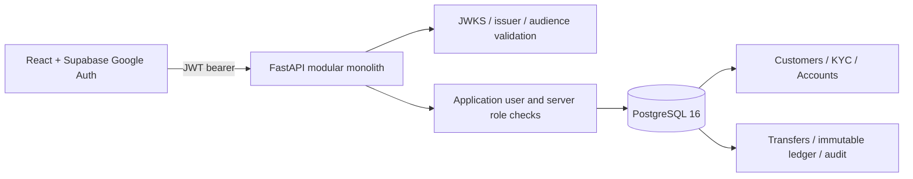
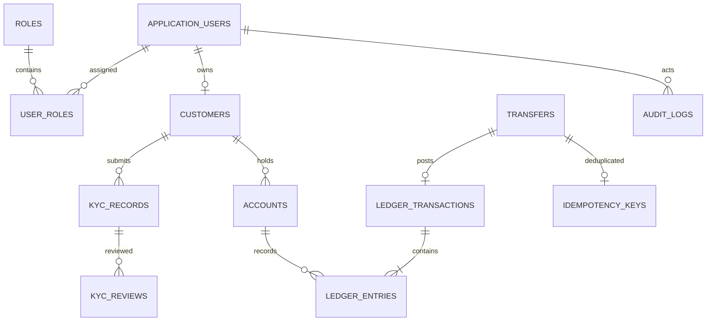

# Banking Core Operations

A modular FastAPI and React operations workspace using PostgreSQL. BankCRM serves Swagger at `http://localhost:8001/docs`; Project 1 keeps host port 8000. The Vite UI runs at `http://localhost:5173`.

## Configure and run

1. Copy `.env.example` to `.env`. Keep the already configured PostgreSQL database values and port `5433` intact. Copy `SUPABASE_URL` and the browser-safe `VITE_SUPABASE_URL` and `VITE_SUPABASE_PUBLISHABLE_KEY` from the existing Supabase project. Set a local `POSTGRES_PASSWORD` and matching `DATABASE_URL`. Set `SUPABASE_JWT_AUDIENCE` to the token audience (normally `authenticated`). No service role key is used.
2. Start database and backend: `docker compose up --build -d`.
3. Start UI: `cd frontend && npm install && npm run dev`.
4. Open the UI and sign in with Google. The first login creates a local application-user record and assigns only the `customer` role. The customer profile can then be created in the UI and a fictional `DEMO-...` KYC reference submitted.
5. Provision the manager explicitly after their first login: `docker compose exec api python -m app.cli provision-manager`. This command verifies that `dasrupdip04@gmail.com` is an existing authenticated application user before adding administrator access and writing an audit event. Running it again is safe. If using the host API instead, run `cd backend && python -m app.cli provision-manager` with the app's Python environment and root `.env` loaded.
6. Seed the manager overview with synthetic records: `docker compose exec api python -m app.cli seed-demo`.

For a complete walkthrough, open two browser profiles. In the manager profile, sign in as `dasrupdip04@gmail.com`, provision once, then seed the synthetic cases. In the customer profile, sign in with a separate Google account, create its customer profile, and submit a fictional `DEMO-...` reference. In the manager profile, review it in Compliance with a reason, then open an account for that approved customer. The customer can refresh and use their own account; managers can use seeded accounts to demonstrate internal transfers. Reports show posted entry totals and account projection reconciliation.

The Compose `api` service uses `db:5432`, applies Alembic migrations on startup, and exposes host port `8001` (container port `8000`). The frontend reads root `.env` values at Vite startup; restart `npm run dev` after changing them. For local API development outside Docker, use the host URL on port `5433`: `cd backend && alembic upgrade head && uvicorn app.main:app --reload --port 8001`.

## Configuration names

Required database values: `POSTGRES_DB`, `POSTGRES_USER`, `POSTGRES_PASSWORD`, `DATABASE_URL`. Supabase: `SUPABASE_URL` and `SUPABASE_JWT_AUDIENCE` (server), `VITE_SUPABASE_URL` and `VITE_SUPABASE_PUBLISHABLE_KEY` (browser). Optional: `FRONTEND_ORIGIN`, `VITE_API_URL`. Use the public publishable key; no privileged Supabase key is needed. `.env` is ignored by Git.

## Architecture



### Entity relationships



### Transfer sequence

```mermaid
sequenceDiagram
  participant C as Client
  participant A as API
  participant D as PostgreSQL
  C->>A: POST transfer + Idempotency-Key
  A->>D: Begin transaction; check idempotency
  A->>D: Lock both account rows ordered by UUID
  A->>D: Validate status, currency, owner, available balance
  A->>D: Insert transfer, balanced ledger entries, audit, key; update projections
  A->>D: Commit
  A-->>C: Posted result
```

## Role and permission matrix

| Role | Scope |
| --- | --- |
| Customer | Own profile, accounts, statements, transfers |
| Teller | Customer lookup, account opening, transfers |
| Operations | Teller scope, operational views and reconciliation |
| Compliance officer | KYC queue and review |
| Auditor | Read-only audit and reconciliation reporting |
| Administrator | User role management and operational access |

## API and security notes

All endpoints are discoverable in Swagger. Main routes: `/api/me`, `/api/dashboard`, `/api/customers`, `/api/kyc`, `/api/accounts`, `/api/accounts/{id}/fund` (administrator only, requires a seeded system clearing account and `Idempotency-Key`), `/api/transfers`, `/api/accounts/{id}/statement`, `/api/reports/reconciliation`, `/api/audit`, and `/api/admin/roles`. Health endpoints are `/health` and `/health/db`.

Access tokens are verified against Supabase JWKS with ES256/RS256 allowlisting, issuer and audience checks. A verified `sub` is mapped to a local user; roles live in the database. The existing manager provisioning command assigns `administrator`, which is the server-side manager role and intentionally coexists with the default `customer` role. The administrator role takes precedence for manager operations. The transfer API locks accounts in sorted UUID order, checks constraints after locking, stores amount as NUMERIC/Decimal, commits both ledger sides and projections together, and binds idempotency keys to a request hash. Posted entries are application-immutable; production deployments should additionally enforce immutability with database permissions/triggers and operational controls. Demo funding is a balanced posting against a synthetic system-clearing ledger account.

KYC uses synthetic references only. Never submit real Aadhaar/PAN or customer financial data. Demo onboarding does not automate identity verification, sanctions screening, payment rails, or regulatory reporting. Initial admin bootstrap is a trusted operator action. TLS, key rotation, rate limits, fraud controls, retention policy, backup/restore drills, and independent security review are deployment requirements.

## Tests

Focused tests live under `backend/tests`. Run with `docker compose exec api python -m pytest -q` or `cd backend && pytest -q` in a local Python environment. Seed synthetic examples with `docker compose exec api python -m app.cli seed-demo`. This idempotent, additive command creates approved, pending and rejected KYC examples, accounts, balanced funding and transfers, and audit events. It does not create or promote application users.

## Troubleshooting and verification

- Start or inspect services with `docker compose up -d --build`, `docker compose ps`, and `docker compose logs -f api` (the API service name is `api`, not `backend`).
- Check API and PostgreSQL with `curl -i http://localhost:8001/health` and `curl -i http://localhost:8001/health/db`.
- Run or inspect schema migration state with `docker compose exec api alembic current` and apply with `docker compose exec api alembic upgrade head`.
- First Google login creates/syncs the local user and gives it only the customer role. The user must exist in `application_users` before manager bootstrap. Then run `docker compose exec api python -m app.cli provision-manager`.
- To check a customer token, use the browser-authenticated app or Swagger Authorize. `/api/me` should show `customer` for a normal user; manager should show `administrator`. The customer can access only their own `/api/customers`, `/api/accounts`, `/api/transfers`, and `/api/kyc/mine` data. Manager-only KYC review uses `/api/kyc` and `/api/kyc/{id}/review`.
- A refused connection to port 8001 means the API is stopped or bound elsewhere. A 401 means the bearer token was missing/invalid or the Supabase issuer/audience config does not match. A 403 means the authenticated application user lacks the endpoint role; customers should use customer routes, and the manager must be provisioned through the explicit command above.
